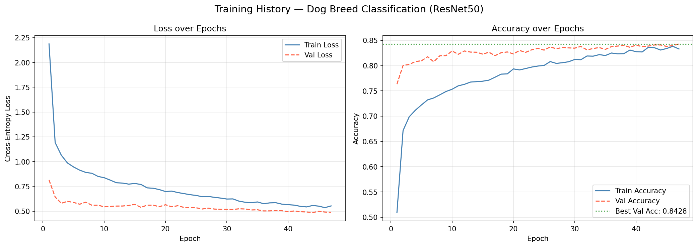
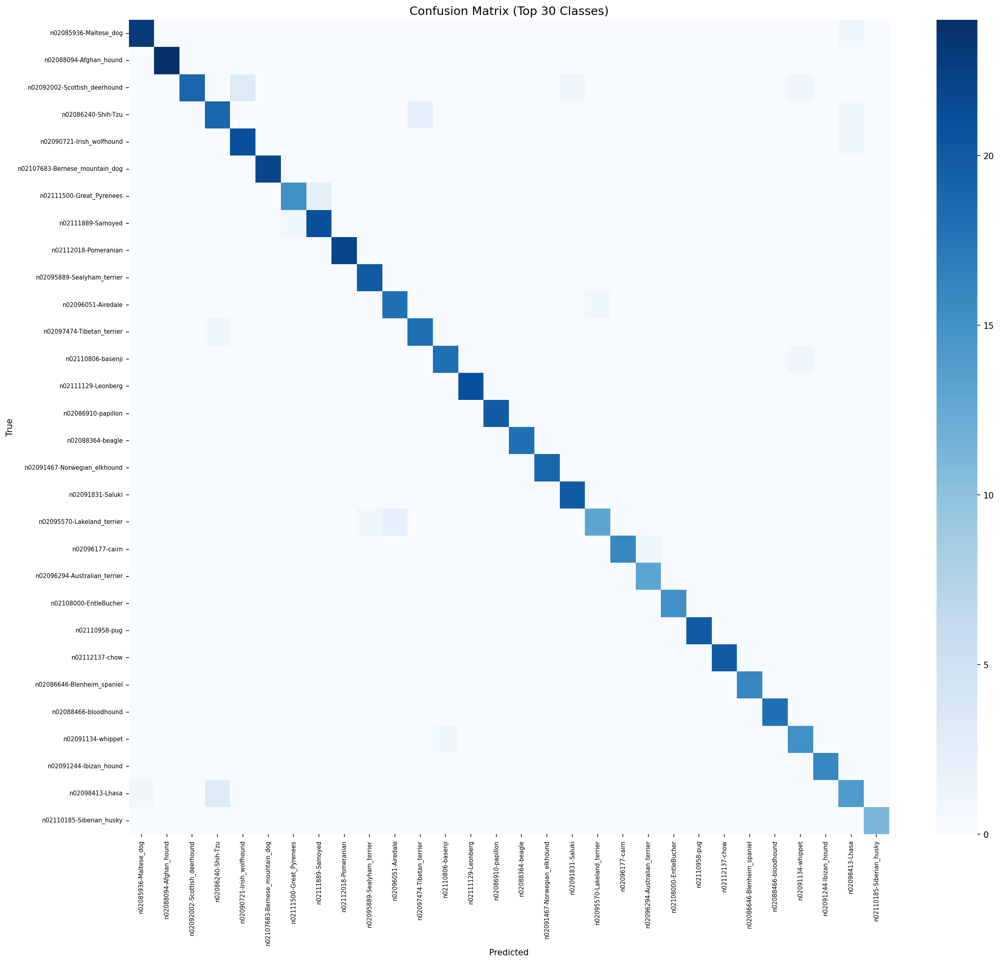
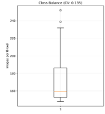
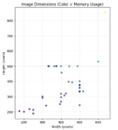
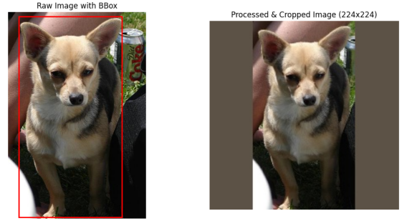
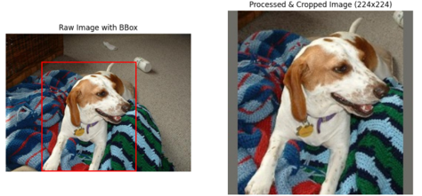
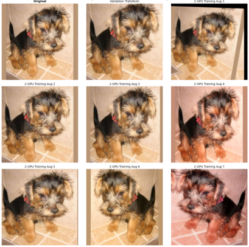
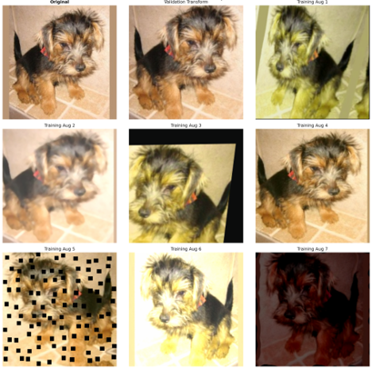

# Dog Breed Classification using Deep Learning

A fine-grained image classification system that identifies **120 dog breeds** from the Stanford Dogs Dataset using transfer learning with ResNet50. Achieves **84.56% test accuracy**, **96.89% Top-3**, and **98.25% Top-5 accuracy** across 2,059 unseen test images.

---

## Results

| Metric | Score |
|--------|-------|
| Top-1 Accuracy | **84.56%** |
| Top-3 Accuracy | **96.89%** |
| Top-5 Accuracy | **98.25%** |
| Macro F1-Score | **84.00%** |
| Macro Precision | 84.65% |
| Macro Recall | 84.19% |
| Best Validation Accuracy | 84.28% |
| Generalisation Gap | 0.28% |

The very small generalisation gap between validation and test accuracy confirms the model generalises well to unseen data.

### Training History

The plot below shows loss and accuracy curves across all 50 training epochs. Validation accuracy pulls ahead of training accuracy in the early epochs — a healthy sign of effective data augmentation and dropout-style regularisation preventing early overfitting.



### Confusion Matrix (Top 30 Classes)

The diagonal dominance confirms strong per-class accuracy across visually diverse breeds. The few off-diagonal confusions align with real-world visual similarity — for example between similar terrier breeds or between sled dog breeds.



### Notable Per-Class Results

Breeds achieving perfect F1-score (1.00): **Sussex spaniel**, **Saint Bernard**, **Pomeranian**, **chow**, **keeshond**, **Mexican hairless**, **dhole**.

Hardest breeds (F1 < 0.60): **Eskimo dog** (0.36), **American Staffordshire terrier** (0.50), **miniature poodle** (0.52) — all visually similar to related breeds in the dataset.

---

## Dataset

This project uses the **[Stanford Dogs Dataset](http://vision.stanford.edu/aditya86/ImageNetDogs/)**.

| Property | Value |
|----------|-------|
| Total images | 20,580 |
| Classes (breeds) | 120 |
| Class balance (CV) | 0.135 (well-balanced) |
| Image format | JPEG, varied sizes |
| Annotations | XML bounding boxes |

Each image has an accompanying XML annotation file containing the breed name and bounding box coordinates for the dog.

### Class Distribution

The dataset is well-balanced across all 120 breeds (Coefficient of Variation: 0.135), with most breeds containing between 150 and 250 images.



### Image Dimensions

Raw images vary significantly in size and aspect ratio, which makes a consistent cropping and resizing step essential before training.



> **Note:** `class_balance.png` and `image_dimensions.png` can be regenerated at high resolution by running `python generate_eda_plots.py` after downloading the dataset.

---

## Approach

### 1. Bounding Box Cropping and Resizing

Images are cropped to their annotated bounding boxes before resizing to 224×224. This removes irrelevant background and forces the model to focus on the dog itself — a step that contributed approximately **+7% accuracy** improvement over using uncropped images.





### 2. Transfer Learning with ResNet50

A ResNet50 model pre-trained on ImageNet is used as the backbone. The final fully connected layer is replaced with a new `Linear(2048, 120)` layer for the 120-breed classification task. The backbone is frozen in the first training phase so only the classification head is trained initially.

### 3. On-the-Fly Data Augmentation

Augmentations are applied dynamically during training using [Albumentations](https://albumentations.ai/), so the model sees a different variation of each image every epoch. No augmented images are stored on disk.

| Transform | Purpose |
|-----------|---------|
| `RandomResizedCrop` | Varied framing and zoom levels |
| `HorizontalFlip` | Orientation invariance |
| `ShiftScaleRotate` | Geometric perturbation |
| `ColorJitter`, `HueSaturationValue`, `RGBShift` | Colour and lighting robustness |
| `GaussNoise`, `GaussianBlur` | Noise and defocus robustness |
| `CoarseDropout`, `RandomErasing` | Occlusion regularisation |

Validation and test sets use only deterministic resize + centre crop + normalisation — no random transforms.

The grids below show the original image (top-left), the validation transform (top-centre), and seven distinct training augmentations applied to the same image:





---

## Repository Structure

```
├── preprocessing.py          # Dataset exploration, annotation parsing, crop+resize, splitting
├── augmentation.py           # Albumentations train/val transform pipelines
├── dataset.py                # PyTorch Dataset class and DataLoader factory
├── model.py                  # ModelFactory — ResNet50 / EfficientNet-B0 with transfer learning
├── train.py                  # Training loop, optimiser, scheduler, checkpointing
├── evaluate.py               # Inference, metrics, confusion matrix, training curves
├── generate_eda_plots.py     # Regenerates class_balance.png and image_dimensions.png
├── requirements.txt          # Python dependencies
└── assets/
    ├── class_balance.png
    ├── image_dimensions.png
    ├── preprocessing_sample_1.png
    ├── preprocessing_sample_2.png
    ├── augmentation_sample_1.png
    ├── augmentation_sample_2.png
    ├── training_curves.png
    └── confusion_matrix.png
```

---

## Dependencies

```bash
pip install -r requirements.txt
```

| Package | Purpose |
|---------|---------|
| `torch`, `torchvision` | Deep learning framework and pretrained models |
| `albumentations` | Data augmentation pipeline |
| `opencv-python`, `Pillow` | Image reading and processing |
| `scikit-learn` | Metrics and stratified splitting |
| `xmltodict` | Annotation file parsing |
| `matplotlib`, `seaborn` | Visualisation |
| `tqdm` | Progress bars |

---

## How to Run

### 1. Download the dataset

Download the Stanford Dogs Dataset from the [official page](http://vision.stanford.edu/aditya86/ImageNetDogs/) and place it as follows:

```
data/
├── Images/
│   ├── n02085620-Chihuahua/
│   ├── n02085782-Japanese_spaniel/
│   └── ...
└── Annotation/
    ├── n02085620-Chihuahua/
    ├── n02085782-Japanese_spaniel/
    └── ...
```

### 2. (Optional) Generate EDA plots

```bash
python generate_eda_plots.py
```

Produces `assets/class_balance.png` and `assets/image_dimensions.png` at 200 DPI.

### 3. Preprocess the dataset

```bash
python preprocessing.py
```

Parses all XML annotation files, crops each image to its bounding box, resizes to 224×224, performs a stratified 70/20/10 train/val/test split, and saves all outputs under `processed_data/`:

```
processed_data/
├── train/          # 13,859 images across 120 breed folders
├── val/            # 4,057 images
├── test/           # 2,050 images
├── class_mappings.json
└── split_info.json
```

### 4. Train the model

```bash
python train.py
```

Training configuration is defined in `TrainingConfig` at the top of `train.py`. The best checkpoint is saved to `checkpoints/dog_breed_resnet50/best_model.pth`.

### 5. Evaluate the model

```bash
python evaluate.py
```

Saves to `evaluation_results/`:
- `metrics.json` — all numeric metrics
- `classification_report.txt` — per-class precision, recall, F1
- `confusion_matrix.png` — top-30 class confusion matrix
- `training_curves.png` — combined loss and accuracy curves

---

## Training Configuration

| Parameter | Value |
|-----------|-------|
| Architecture | ResNet50 (ImageNet pretrained) |
| Epochs | 50 |
| Batch size | 64 |
| Optimiser | AdamW |
| Learning rate | 1e-3 |
| Weight decay | 1e-2 |
| Scheduler | CosineAnnealingLR |
| Mixed precision | Yes (AMP) |
| Gradient clipping | Yes (max_norm=1.0) |
| Input size | 224 × 224 |

---

## Training Environment

Training was performed on the University of Luxembourg HPC Iris cluster using 2× Tesla V100 16 GB GPUs with CUDA 12.7 and PyTorch 2.1.

---

## Notes

- Model checkpoint (`.pth`) and `processed_data/` are excluded from the repository via `.gitignore` due to file size.
- To use EfficientNet-B0 instead of ResNet50, change `model_name="efficientnet_b0"` in `train.py`.
- Setting `freeze_feature_extractor=False` in `TrainingConfig` fine-tunes all layers rather than just the classification head.
